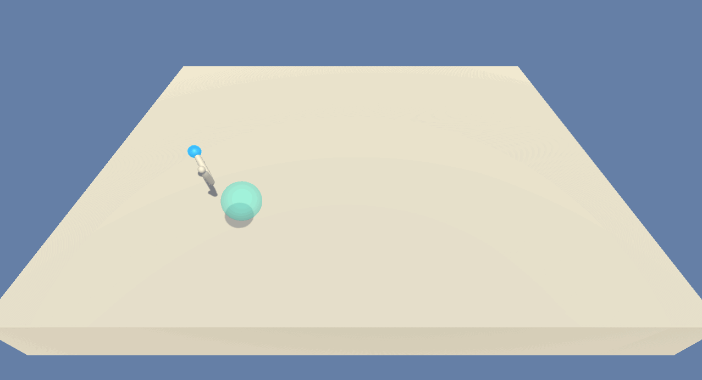

# Pytorch_DDPG_Unity_Continuous_Control
Deep Reinforcement Learning Agent that solves a continuous control task using Deep Deterministic Policy Gradients (DDPG)


Shown above: A trained agent that moves the two-jointed arm such that the hand stays within the moving target at all times.

Uses Unity-ML Reacher environment: https://github.com/Unity-Technologies/ml-agents/blob/master/docs/Learning-Environment-Examples.md#reacher

Written using Python 3 and Pytorch.

## Deep Reinforcement Learning
Uses Deep Deterministic Policy Gradients written in Pytorch. For further info on DDPG: https://arxiv.org/pdf/1509.02971.pdf

## The Environment
#### State Space
Uses a state with 33 numeric features. These features include information such as position, rotation, velocity, and angular velocities of the two separate arm segments.

#### Action Space
4 continuous actions that are taken at every time step that take a value between -1 and 1 inclusively. These features represent the torque applied to each joint.

#### Scoring
The agent is rewarded when the edge of the arm stays within the moving sphere. More information can be read about the scoring here: https://github.com/Unity-Technologies/ml-agents/blob/master/docs/Learning-Environment-Examples.md#reacher

#### Termination
The game terminates after 1000 time steps.

## Dependencies
```
copy
math
numpy
pickle
random
sys
torch
unityagents
```

## Solve criteria
The agent has "solved" the environment if it achieves an average score of 30 in 100 consecutive games.

## Usage
Extract the Reacher_Windows_x86_64 folder.
All code is contained in the ipynb notebook, Report. Run each cell to train the agent from scratch.



Shown above: The randomly initialized agent before training.

Weights are saved (included) for all four neural networks in the network_weights folder.

Metric data use to generate graphs are all saved in the data folder.

## Further details
View report.ipynb to view an explanation of the implementation.
